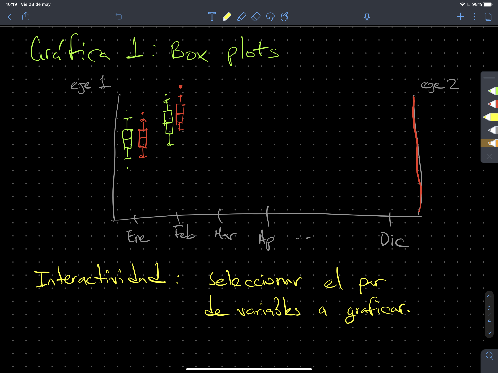
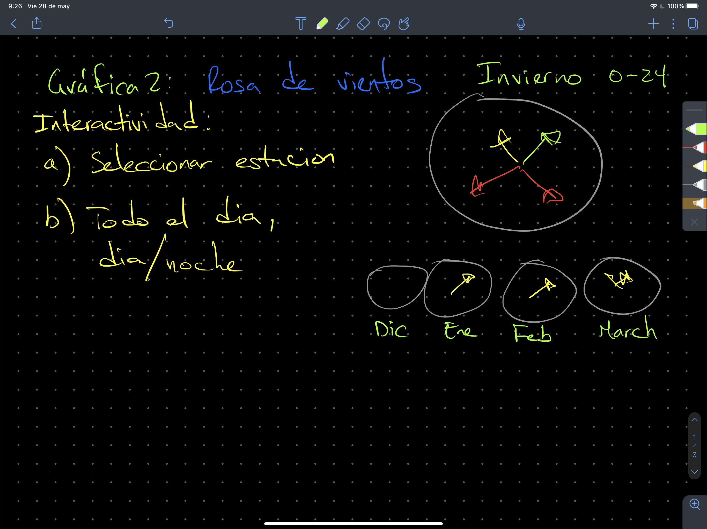
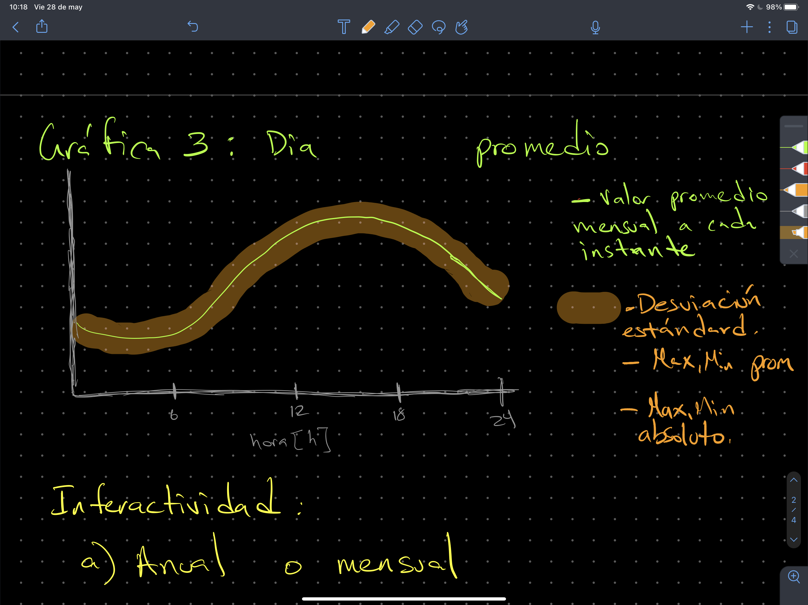
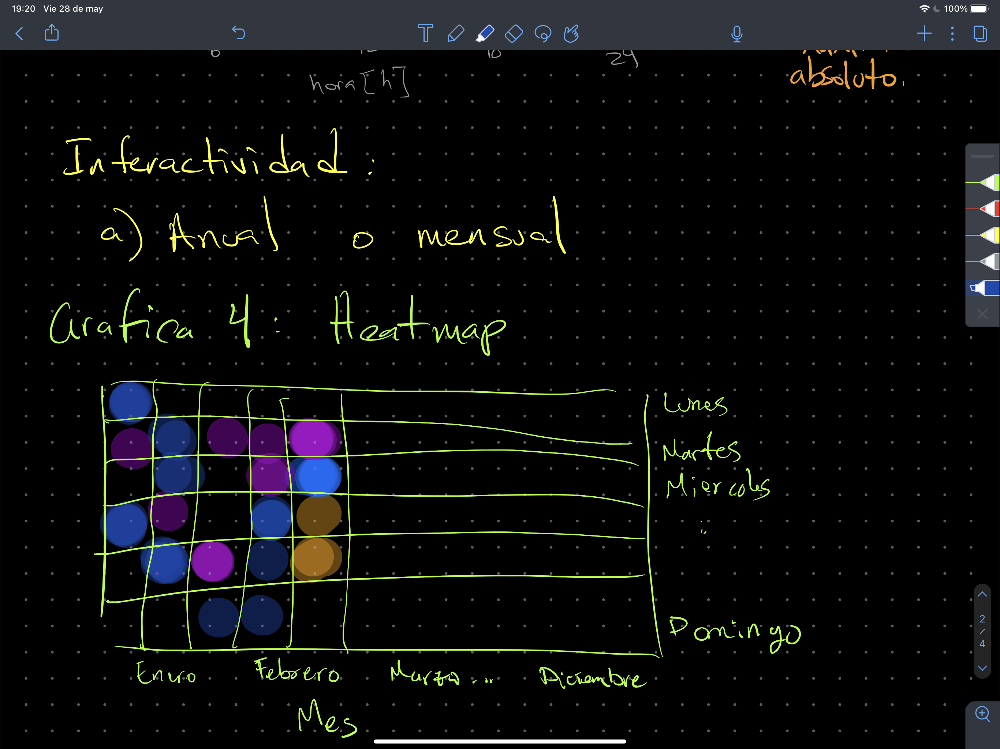

# pf_python2021_IER
Proyecto final para la materia de Python impartida de febrero a junio 2021,
se debe entregar a m'as tardar el d'ia 25 de junio a las 12:00 horas tiempo
del centro de Mx.

Se debe programar una clase que haga lo siguiente:

```
import proyecto as pf

a = pf.analisis()

a.importa('archivo.csv')
```

La clase debe realizar cuatro acciones explíticas, es decir
```
a.boxplot()  # genera ejercicio 1 descrito m'as adelante

a.rosa_viento()  # genera ejercicio 2 descrito m'as adelante

a.variable_dia()  # genera ejercicio 3 descrito m'as adelante

a.heatmap_anual()  # genera ejercicio 4 descrito m'as adelante
```

al ejecutar el m'etodo correspondiente, debe guardar en
el folder resultados/ un png de la figura obtenida, con
especificaciones para cada m'etodo/figura.

Puntos:
| Descripción |  Puntos |
|-------------|--------:|
|Clase en un archivo .py          | 10 |
|Documentaci'on por m'etodo final | 20 |
|Estructura de proyecto adecuada  | 15 |


___
1. Una gr'afica de boxplot, tomen como guía la siguiente figura:


 Para cada mes se deben graficar el boxplot correspondiente
 al mes. El boxplot debe visualizar
 el promedio de la variable seleccionada en lugar de la mediana.
 El método debe permitir seleccionar las variables a graficar, cada
 variable debe tener su propio eje y con su escala.

 Al realizar la gr'afica, debe guardar en la carpeta resultados/
 el archivo png con un nombre que le permita distinguir el mes y
 la variable seleccionada.

 | Descripción |  Puntos |
 |-------------|--------:|
 |Boxplot por mes           | 20 |
 |Uso de mean en el boxplot |  5 |
 |Selecci'on de variables   | 10 |
 | Formato de la figura(unidades,etc) | 10 |
 | Guardar imagen con descripci'on | 10 |


___  


2. Una rosa de vientos, tomen como guía la siguiente figura:


Crear una rosa de vientos donde permita definir la estación (primavera,
  verano, otoño, invierno) y grafique los meses que incluyen esa estación
  como se esquematiza en la figura.
  Además, el método debe permitir seleccionar si la rosa de viento mostrada
  corresponde a todo el día (0 a 23 horas) o solo diurno (8 a 20 horas) y
  nocturno (20:01  a 7:59 horas).

  Al realizar la gr'afica, debe guardar en la carpeta resultados/
  el archivo png con un nombre que le permita distinguir la estaci'on y
  el periodo seleccionado.


  | Descripción |  Puntos |
  |-------------|--------:|
  |Rosa de viento por estaci'on    | 20 |
  |Rosa de viento por meses        | 10 |
  |Selecci'on de dia completo, diurno, nocturno   | 10 |
  | Formato de la figura(unidades,etc) | 10 |
  | Guardar imagen con descripci'on    | 10 |


___


3. Un gráfica donde se presente el valor de la variable promediada cada paso
temporal, tomen como referencia la imagen:


El m'etodo debe permitir seleccionar la variable a graficar,
los limites superiores e inferiores  de la zona sombreada deben indicar : a) la desviaci’on est’andar, b) el promedio de los m’aximo y m’inimos, y c) el valor m’aximo y m’inimo, todos de cada paso temporal.

También se debe poder seleccionar si se desea una gráfica anual o de un mes
específico.


Al realizar la gr'afica, debe guardar en la carpeta resultados/
el archivo png con un nombre que le permita distinguir la variable promediada y
si se seleccion'o promedio, valor promedio m'aximo, m'inimo o solo el m'aximo/m'inimo.

  | Descripción |  Puntos |
  |-------------|--------:|
  |Grafica de promedio por paso temporal  por variable   | 15 |
  |Uso sombreado    por variable          | 10 |
  |Selecci'on de a) std, b) promedio(max, min), c) max y min para la zona sombreada   | 20 |
  | Formato de la figura por variable (unidades,etc) | 10 |
  | Guardar imagen con descripci'on                  | 10 |


___


4. Un  __heatmap__ de la **variable** seleccionada para las horas
y los d'ias , toma como referencia la siguiente imagen:



Se debe poder seleccionar la variable a visualizar, y el valor a calcular
por variable debe ser el valor m'aximo, el valor m'inimo, el promedio,
y la desviaci'on est'andar de la variable.


Al realizar la gr'afica, debe guardar en la carpeta resultados/
el archivo png con un nombre que le permita distinguir la variable  y
si se seleccion'o promedio, valor promedio m'aximo, m'inimo o solo el m'aximo/m'inimo.


  | Descripción |  Puntos |
  |-------------|--------:|
  |Grafica de heatmap anual horario  por variable   | 20 |
  | Formato de la figura por variable (unidades,etc) | 10 |
  | Guardar imagen con descripci'on | 10 |


  ___

# Calificaci'on

La calificaci'on est'a compuesta de


| Descripción |  Puntos |
|:-------------:|--------:|
|Clase en un archivo .py          | 10 |
|Documentaci'on por m'etodo final | 20 |
|Estructura de proyecto adecuada  | 10 |
 | Gr'afica 1 |  Puntos |
 |Boxplot por mes           | 20 |
 |Uso de mean en el boxplot |  5 |
 |Selecci'on de variables   | 10 |
 | Formato de la figura(unidades,etc) | 10 |
 | Guardar imagen con descripci'on                  | 10 |
  | Gr'afica 2 |  Puntos |
  |Rosa de viento por estaci'on    | 20 |
  |Rosa de viento por meses        | 10 |
  |Selecci'on de dia completo, diurno, nocturno   | 10 |
  | Formato de la figura(unidades,etc) | 10 |
  | Guardar imagen con descripci'on                  | 10 |
  | Gr'afica 3 |  Puntos |
  |Grafica de promedio por paso temporal  por variable   | 15 |
  |Uso de fillbetween  por variable          | 10 |
  |Selecci'on de a) std, b) promedio(max, min), c) max y min para la zona sombreada   | 20 |
  | Formato de la figura por variable (unidades,etc) | 10 |
  | Guardar imagen con descripci'on                  | 10 |
  | Gr'afica 4 |  Puntos |
  |Grafica de heatmap anual horario  por variable   | 20 |
  | Formato de la figura por variable (unidades,etc) | 10 |
  | Guardar imagen con descripci'on                  | 10 |
  | **Puntos totales**  | **260** |
